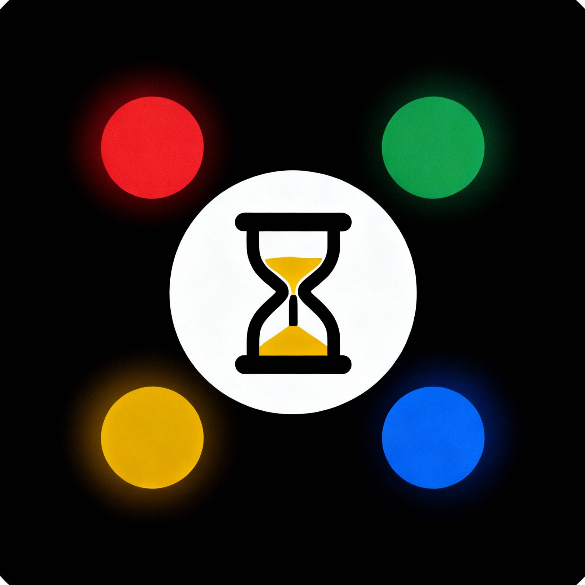

# 📱 DigiBalance V3

<div align="center">



**Transform Screen Time into Productive Time**

A comprehensive digital wellness and parental control platform that empowers students, supports parents, and promotes healthy digital habits through gamification and real-time monitoring.

[](https://kotlinlang.org)
[](https://developer.android.com/jetpack/compose)
[](https://developer.android.com)
[](LICENSE)

[Features](#-features) • [Screenshots](#-screenshots) • [Tech Stack](#-tech-stack) • [Getting Started](#-getting-started) • [Architecture](#-architecture)

</div>

---

## 🌟 Why DigiBalance?

In today's digital age, managing screen time is crucial for productivity and mental health. DigiBalance goes beyond simple app blocking—it creates a comprehensive ecosystem that:

- 🎯 **Motivates** students through competitive leaderboards
- 👨‍👩‍👧 **Empowers** parents with real-time insights and controls
- 🧠 **Educates** users with curated awareness content
- 🔒 **Protects** focus time with unbreakable kiosk mode
- 📊 **Tracks** usage patterns with detailed analytics

## ✨ Features

### 🎭 Three User Roles

<table>
<tr>
<td width="33%">

**👨‍🎓 Student**
- Track screen time
- Compete on leaderboards
- Focus mode for studying
- Awareness videos
- Gamertag system

</td>
<td width="33%">

**👨‍👩‍👧 Parent**
- Real-time monitoring
- Set app time limits
- Emergency codes
- Screenshot requests
- Link multiple students

</td>
<td width="33%">

**💼 Professional**
- Advanced analytics
- Research insights
- Bulk management
- Custom reports
- API access

</td>
</tr>
</table>

### 🎮 Gamification & Competition

- **Weekly Leaderboards**: Compete with peers based on productive app usage
- **Gamertag System**: Create unique identities and track rankings
- **Achievement Tracking**: Earn rewards for consistent productive behavior
- **Real-time Updates**: See your rank change as you use productive apps

### 🔒 Focus Mode (Kiosk Launcher)

- **Unbreakable Protection**: Survives device reboots and force stops
- **Customizable Whitelist**: Allow only essential apps during focus time
- **Emergency Exit**: Parents can generate time-limited emergency codes
- **Motivational Quotes**: Stay inspired during focus sessions
- **DND Integration**: Automatically enables Do Not Disturb mode

### 👨‍👩‍👧 Parental Controls

- **Real-time Rule Sync**: Changes apply instantly via Supabase Realtime
- **Offline Support**: Rules cached locally for reliability
- **Total Time Limits**: Set daily screen time caps
- **Per-App Limits**: Control individual app usage
- **Personal App Blocking**: Block distracting apps during study hours
- **Screenshot Requests**: Request device screenshots remotely

### 📊 Usage Analytics

- **Daily/Weekly/Monthly Reports**: Comprehensive usage breakdowns
- **App-wise Statistics**: See time spent in each app
- **Productive vs Distracting**: Categorized app usage
- **Visual Charts**: Beautiful Material 3 charts and graphs
- **Export Data**: Download reports for offline analysis

### 🎓 Awareness & Education

- **Curated Video Library**: Educational content about digital wellness
- **YouTube Integration**: Seamless video playback
- **Category Filtering**: Find content by topic
- **Progress Tracking**: Mark videos as watched

### 🔐 Security & Privacy

- **Supabase Authentication**: Secure email/phone auth with OTP
- **Row Level Security**: Database-level access control
- **Local Encryption**: Sensitive data encrypted on device
- **No Data Selling**: Your data stays yours
- **GDPR Compliant**: Privacy-first architecture

## 📸 Screenshots

<div align="center">

| Splash Screen | Authentication | Role Selection |
|:---:|:---:|:---:|
|  |  |  |

| Reports | Leaderboard | Focus Mode |
|:---:|:---:|:---:|
|  |  |  |

</div>

## 🛠 Tech Stack

### Frontend
- **Kotlin 2.0.21**: Modern, concise, and safe programming language
- **Jetpack Compose**: Declarative UI framework with Material 3
- **Compose Navigation**: Type-safe navigation between screens
- **Coil**: Efficient image loading and caching

### Backend & Database
- **Supabase**: Backend-as-a-Service platform
  - PostgreSQL database with Row Level Security
  - Real-time subscriptions for instant updates
  - Authentication with email/phone OTP
  - RESTful API via PostgREST
- **Room**: Local SQLite database for offline caching
- **DataStore**: Preferences and settings storage

### Networking & Sync
- **Ktor 3.0.3**: Asynchronous HTTP client
- **Kotlinx Serialization**: JSON parsing
- **WorkManager**: Background sync and periodic tasks
- **Realtime Subscriptions**: WebSocket-based live updates

### Android Services
- **Accessibility Service**: Battery-efficient app detection
- **Usage Stats API**: Accurate screen time tracking
- **Foreground Services**: Persistent focus mode monitoring
- **Broadcast Receivers**: Boot completion and app uninstall detection

### Architecture & Patterns
- **MVVM**: Model-View-ViewModel architecture
- **Repository Pattern**: Clean separation of data sources
- **Dependency Injection**: Manual DI with singleton pattern
- **Offline-First**: Local cache with background sync
- **Reactive Streams**: Flow-based data updates

## 🚀 Getting Started

### Prerequisites

- **Java JDK**: Version 11 or higher
- **Android Studio**: Hedgehog (2023.1.1) or later
- **Android SDK**: API Level 24-36
- **Gradle**: 8.4 (included via wrapper)
- **Supabase Account**: Free tier available at [supabase.com](https://supabase.com)

### Quick Setup

1. **Clone the repository**
   ```bash
   git clone https://github.com/HoneyBadger-010/Digibalance.git
   cd Digibalance/Digibalance/application
   ```

2. **Configure Supabase**
   
   Create `local.properties` in the `application/` directory:
   ```properties
   SUPABASE_URL=https://your-project-id.supabase.co
   SUPABASE_ANON_KEY=your-anon-key-here
   ```

3. **Set up database**
   
   Run the SQL schema in your Supabase SQL Editor:
   ```bash
   # Use one of these schema files:
   - SUPABASE_SETUP_COMPLETE.sql (recommended)
   - COMPLETE_PRODUCTION_SCHEMA.sql
   - ULTIMATE_PRODUCTION_SCHEMA.sql
   ```

4. **Build and run**
   ```bash
   ./gradlew assembleDebug
   adb install -r app/build/outputs/apk/debug/app-debug.apk
   ```

For detailed setup instructions, see [application/README.md](Digibalance/application/README.md)

## 🏗 Architecture

```
┌─────────────────────────────────────────────────────────┐
│                     Presentation Layer                   │
│  ┌──────────────┐  ┌──────────────┐  ┌──────────────┐  │
│  │   Compose    │  │  ViewModels  │  │  Navigation  │  │
│  │     UI       │  │              │  │              │  │
│  └──────────────┘  └──────────────┘  └──────────────┘  │
└─────────────────────────────────────────────────────────┘
                          │
┌─────────────────────────────────────────────────────────┐
│                     Domain Layer                         │
│  ┌──────────────┐  ┌──────────────┐  ┌──────────────┐  │
│  │ Repositories │  │  Use Cases   │  │   Models     │  │
│  │              │  │              │  │              │  │
│  └──────────────┘  └──────────────┘  └──────────────┘  │
└─────────────────────────────────────────────────────────┘
                          │
┌─────────────────────────────────────────────────────────┐
│                      Data Layer                          │
│  ┌──────────────┐  ┌──────────────┐  ┌──────────────┐  │
│  │   Supabase   │  │     Room     │  │  DataStore   │  │
│  │   (Remote)   │  │   (Local)    │  │ (Preferences)│  │
│  └──────────────┘  └──────────────┘  └──────────────┘  │
└─────────────────────────────────────────────────────────┘
                          │
┌─────────────────────────────────────────────────────────┐
│                    Services Layer                        │
│  ┌──────────────┐  ┌──────────────┐  ┌──────────────┐  │
│  │Accessibility │  │  WorkManager │  │   Broadcast  │  │
│  │   Service    │  │    Workers   │  │   Receivers  │  │
│  └──────────────┘  └──────────────┘  └──────────────┘  │
└─────────────────────────────────────────────────────────┘
```

### Key Design Decisions

- **Offline-First**: All critical features work without internet
- **Real-time Sync**: Parental rules update instantly via WebSocket
- **Battery Efficient**: Accessibility service optimized for minimal drain
- **Secure by Default**: RLS policies enforce data access control
- **Modular Architecture**: Easy to extend and maintain

## 📁 Project Structure

```
Digibalance/
├── application/
│   ├── app/
│   │   └── src/main/
│   │       ├── java/com/CuriosityLabs/digibalance/
│   │       │   ├── data/              # Data layer
│   │       │   │   ├── local/         # Room database
│   │       │   │   └── repository/    # Data repositories
│   │       │   ├── service/           # Background services
│   │       │   ├── ui/                # Compose UI screens
│   │       │   │   ├── auth/          # Authentication
│   │       │   │   ├── home/          # Main screens
│   │       │   │   ├── parent/        # Parent dashboard
│   │       │   │   ├── settings/      # Settings screens
│   │       │   │   └── theme/         # Material 3 theming
│   │       │   └── util/              # Utilities
│   │       └── res/                   # Resources
│   ├── build.gradle.kts               # Build configuration
│   └── README.md                      # Detailed setup guide
└── dependency new/                    # Android SDK (optional)
```

## 🔒 Required Permissions

DigiBalance requires the following special permissions:

- **Usage Stats Access**: Track app usage and screen time
- **Accessibility Service**: Detect foreground apps for distraction alerts
- **Draw Over Apps**: Display overlay alerts during focus mode
- **Do Not Disturb Access**: Control DND mode during focus sessions
- **Boot Completed**: Restore focus mode after device restart
- **Battery Optimization Exemption**: Ensure reliable background operation

All permissions are requested with clear explanations and can be granted through guided setup screens.

## 🤝 Contributing

This is a private project by CuriosityLabs. For collaboration inquiries, please contact the development team.

## 📄 License

Copyright © 2024 CuriosityLabs. All rights reserved.

This is proprietary software. Unauthorized copying, distribution, or modification is prohibited.

## 🐛 Bug Reports & Feature Requests

Found a bug or have a feature idea? Submit feedback through the app's Help screen or contact us directly.

## 📞 Support & Contact

- **Email**: support@curiositylabs.com
- **GitHub Issues**: [Report a bug](https://github.com/HoneyBadger-010/Digibalance/issues)
- **Documentation**: See [application/README.md](Digibalance/application/README.md)

## 🙏 Acknowledgments

- **Supabase**: For providing an excellent backend platform
- **Jetpack Compose**: For making Android UI development enjoyable
- **Material Design 3**: For beautiful, accessible design guidelines
- **Open Source Community**: For the amazing tools and libraries

---

<div align="center">

**Built with ❤️ by CuriosityLabs**

⭐ Star this repo if you find it useful!

</div>
